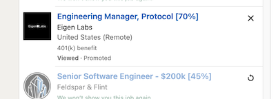

## Using Docker Compose

This document provides instructions on how to use Docker Compose with this project.

### Prerequisites

*   Docker and Docker Compose installed on your system.

### Setup

1.  **Copy the Docker Compose file:**

    ```bash
    curl https://raw.githubusercontent.com/varlabz/dumsum/refs/heads/main/docker-compose.yaml > docker-compose.yaml
    ```

2.  **Copy and configure the `.key` file:**

    ```bash
    curl https://raw.githubusercontent.com/varlabz/dumsum/refs/heads/main/.key.example > .key
    ```

    Edit the `.key` file and add the API key from your provider.

3.  **Create `resume.md`:**

    Copy your resume in Markdown format into the current directory and name it `resume.md`. See the example resume format at [example](https://chatgpt.com/canvas/shared/67d9bb9721288191a9daa49eea914666).

### Running

1.  **Start the application:**

    ```bash
    docker compose up run-try
    ```

    If everything is set up correctly, you will see positions with their match percentage.

    | Before                      | After                     |
    | :-------------------------- | :------------------------ |
    |  |  |

    If you encounter any problems, refer to FAQ.md for troubleshooting.

## Advanced Usage

### Running with a Job Description

1.  **Provide a job description:**

    ```bash
    JOB=job.txt docker compose up run-job
    ```

    Example output:

    ```
    run-job-1  | {'match': '75', 'explanation': "Strong match in project management and Android development experience.  However, the candidate's preferences exclude several technologies mentioned in the job description (AWS, etc.), and the Director-level role requires broader architectural leadership than explicitly demonstrated in the resume."}
    ```

    Copy the job description from a web page and save it into a file (e.g., `job.txt`). The filename can be any name you choose. This compares the job description with your resume and calculates a match percentage, which can be useful for tuning your resume.

### Matching with the Current Page

1.  **Run with `run-try`:**

    ```bash
    docker compose up run-try
    ```

    This runs the application on the current page and stops quickly. It shows positions with a match greater than 70% and doesn't show positions again if the match is less than 50%. This is useful for quickly filtering positions.

### Applying to Positions on the Current Page

1.  **Run with `run-1-page`:**

    ```bash
    docker compose up run-1-page
    ```

    This runs the application on the current page and stops quickly. It automatically clicks the "apply" and "easy apply" buttons for positions with a match greater than 70% and doesn't show positions again if the match is less than 50%.

### Full Usage (Continuous Mode)

1.  **Run with `run-all`:**

    ```bash
    docker compose up run-all
    ```

    This runs the application non-stop on all pages with maximum speed. It automatically clicks the "apply" and "easy apply" buttons for positions with a match greater than 70%.

### Development Mode

1.  **Start development mode:**

    ```bash
    docker compose up dev
    ```

    This starts the application in development mode (see DEVELOPMENT.md for more details).

### Command Line Options

*   Run with the `--help` argument to see available options:

    ```bash
    docker compose up run-help
    ```
