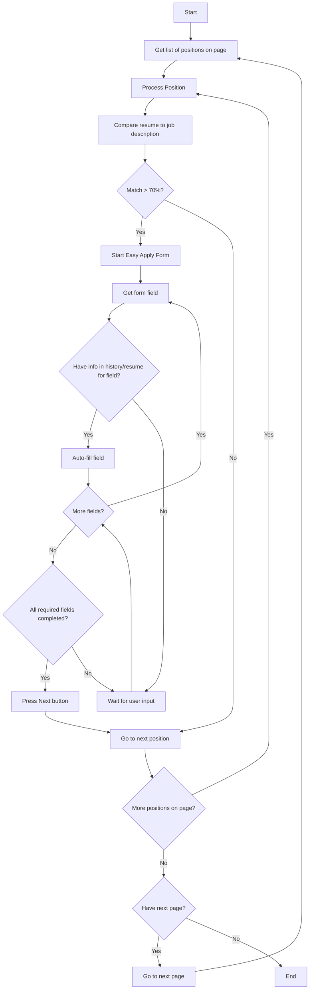

## The Goal of the project
This tool automates the LinkedIn "Easy Apply" process by:
- Streamlining the application workflow
- Walking through questionnaire steps automatically
- Reducing application submission time
- Maintaining application quality while improving efficiency

Benefits:
- Faster application submissions
- Consistent application process
- Reduced manual effort
- Better time management for job seekers

## Prerequisites

Before proceeding, ensure that the following tools are installed and configured on your system:
- **Docker**: You will need Docker to build and run the container.
- **Google Chrome Browser**: This is required for running script.
- **LinkedIn.com**: You should log in and search for positions using your criteria. (The bot doesn't use and save your credentials.)

## FLow diagram of the process
<details>
<summary>Click to expand</summary>



</details>

## Setting Up Chrome for Remote Debugging

To enable Chrome's remote debugging feature, follow these steps:

1. **Launch Google Chrome with Remote Debugging on Mac OS**  
   Open the terminal and run the following command to start Chrome with the remote debugging port enabled:
   ```bash
   open -a "Google Chrome.app" --args --remote-debugging-port=9222
   ```
   This command will open Google Chrome and set it to listen for debugging connections on port `9222`.

2. **Verify Chrome's Command Line Parameters**  
   To confirm that Chrome is running with the correct remote debugging flag, open the following URL in Chrome:
   ```
   chrome://version/
   ```
   Under the section titled **"Command Line"**, ensure that the parameter `--remote-debugging-port=9222` is present. This confirms that Chrome is ready to accept remote debugging sessions.

3. **Check if Remote Debugging is Active**  
   In your browser, navigate to the following URL to check if Chrome’s debugging is accessible:
   ```
   http://localhost:9222/json/version/
   ```
   If everything is set up correctly, you should receive a JSON response similar to this:
   ```json
   {
      "Browser": "Chrome/129.0.6668.101",
      "Protocol-Version": "1.3",
      "User-Agent": "Mozilla/5.0 (Macintosh; Intel Mac OS X 10_15_7) AppleWebKit/537.36 (KHTML, like Gecko) Chrome/129.0.0.0 Safari/537.36",
      "V8-Version": "12.9.202.27",
      "WebKit-Version": "537.36 (@129d018cd38423003cd025fe9ef01c75a897203b)",
      "webSocketDebuggerUrl": "ws://localhost:9222/devtools/browser/5c17626d-5a62-4060-8f17-dc20ff9609de"
   }
   ```
   This response confirms that the remote debugging service is active and ready for connections.

## Building the Docker Container (use 1 of them)

**Build the Docker Image Locally**  
   You can build the Docker image from a local Dockerfile by using the following command:
   ```bash
   DOCKER_BUILDKIT=1 docker build -t linkedin-pw .
   ```
   This will create an image tagged as `linkedin-pw`.

or

**Build the Docker Image from a Git Repository**  
   You can build the image directly from the repository. Ensure that you have your GitHub authentication token, then use this command:
   ```bash
   docker build -t linkedin-pw https://${GIT_AUTH_TOKEN}@github.com/var-lab/dumsum.git
   ```
   Replace `GIT_AUTH_TOKEN` with your actual GitHub authentication token.

or

**Pull Pre-built Docker Image (recommended)**
 
   You can pull the image directly using:
   ```bash
   docker pull varlabz/linkedin-pw
   ```

## Running the Docker Container


   To start the Docker container, use the following command:
   ```bash
   docker run -it --rm --net=host -v ./<your directory>:/app/data --env-file .key linkedin-pw \
   [--matcher NUM] [--matcher-ignore NUM] [--speed 0/1] [--click-apply] [--click-easy-apply] \
   [--debug-easy-apply-form] [--debug-matcher] [--debug-1page]
   ```

   **ATTENTION**: *Before running Docker, copy your updated resume.md into the local ./data directory*
   
   This command will:
   - Run with argument --help see usage
   - Run the `linkedin-pw` container interactively (`-it`) and remove it when stopped (`--rm`).
   - Mount the local `./data` directory into the container at `/app/data`.
   - Use .key file to keep API keys:
     - Set the `GROQ_API_KEY` environment variable with a key from https://console.groq.com/keys (free, limited usage).
     - Set the `OPENAI_API_KEY` environment variable with a key from https://platform.openai.com/api-keys (not free, uses an inexpensive model).
     - Set the `ANTHROPIC_API_KEY` environment variable with a key from https://console.anthropic.com/settings/keys (not free, uses an inexpensive model).
   - Use *optional* parameter `matcher` to use resume matcher to filter job positions. Specify a percentage (0-100) for matching threshold. By default, the script retrieves all positions from the search results.

   
## Obtaining a GitHub Authentication Token

If you don’t already have a GitHub authentication token, follow these steps:

1. Visit GitHub's [Personal Access Tokens](https://github.com/settings/tokens) page.
2. Click **Generate new token**.
3. Select the appropriate scopes required for your repository access.
4. Once generated, store the token safely for use with Git operations.

For more details, check out this GitHub [discussion](https://github.com/orgs/community/discussions/74701) on generating access tokens.

## Usage 

1. **Log In**: Access your LinkedIn account and log in.
2. **Go to the Search Page**: Navigate to the job search page.
3. **Set Filters and Criteria**: In the search fields, enter the filters and criteria (e.g., job title, location, experience level) to find relevant job listings.
4. **Start the Search**: Click the search button to view results based on your specifications.
5. **Run the Bot**: Once the results load, activate the bot to automatically use the "Easy Apply" feature on listings that match your search criteria.

Follow these steps to simplify and speed up your job application process!

## DISCLAIMER

By using this project (the "Project"), you acknowledge and agree to the following terms and conditions:

**No Warranty:** The Project is provided "as is" without any warranty of any kind, express or implied, including but not limited to warranties of merchantability, fitness for a particular purpose, and non-infringement.  The authors or contributors of the Project make no representations or warranties about the accuracy, completeness, reliability, suitability, or availability with respect to the Project or the information, products, services, or related graphics contained in the Project for any purpose.  Any reliance you place on such information is therefore strictly at your own risk.

**No Liability:** In no event will the authors or contributors of the Project be liable for any loss or damage including without limitation, indirect or consequential loss or damage, or any loss or damage whatsoever arising from loss of data or profits arising out of, or in connection with, the use of this Project.  This includes, but is not limited to, any errors or omissions in the content of the Project.

**Non-Commercial Use:**  This Project is provided for non-commercial use only.  You may not use this Project for any commercial purpose, including but not limited to selling, licensing, or distributing the Project or any derivative works thereof for profit.

**Use at Your Own Risk:** You understand and agree that you are using the Project entirely at your own risk.  You are solely responsible for any consequences, losses, or damages that may result from your use of the Project.

By using the Project, you signify your acceptance of this disclaimer. If you do not agree to this disclaimer, do not use the Project.

## License

This project is licensed under the [Creative Commons Attribution-NonCommercial 4.0 International License](LICENSE.md).