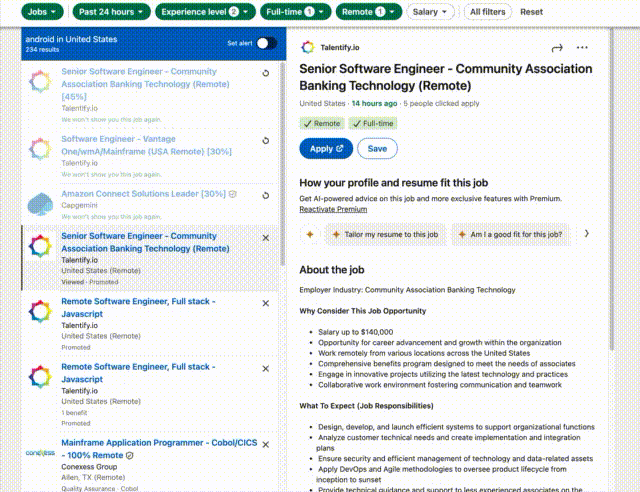
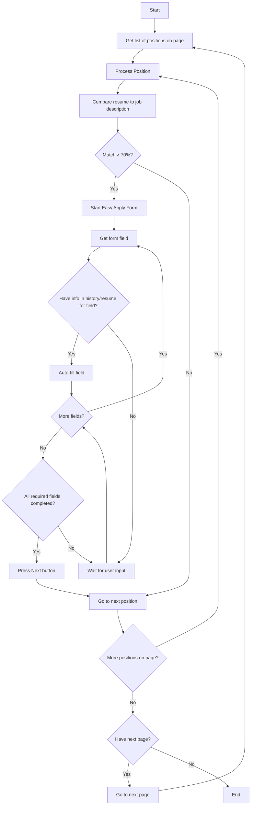

## Project Goal
Simplify the job application process.

Benefits:
- Faster application submissions
- Consistent application process
- Reduced manual effort
- Better time management for job seekers

## Process Flow

Click to expand

## Running with Docker (recommended)

Instructions for building and running the application using Docker can be found in [DOCKER.md](DOCKER.md).

## Development Setup

Instructions for setting up the development environment can be found in [DEVELOPMENT.md](DEVELOPMENT.md).

## Usage 

1. **Log In**:  Sign in to your LinkedIn account.
2. **Go to the Search Page**: Navigate to the job search page.
3. **Set Filters and Criteria**: In the search fields, enter the filters and criteria (e.g., job title, location, experience level) to find relevant job listings.
4. **Start the Search**: Click the search button to view results based on your specifications.
5. **Run the Bot**: Once the results load, activate the bot.

## DISCLAIMER

By using this project (the "Project"), you acknowledge and agree to the following terms and conditions:

**No Warranty:** The Project is provided "as is" without any warranty of any kind, express or implied, including but not limited to warranties of merchantability, fitness for a particular purpose, and non-infringement.  The authors or contributors of the Project make no representations or warranties about the accuracy, completeness, reliability, suitability, or availability with respect to the Project or the information, products, services, or related graphics contained in the Project for any purpose.  Any reliance you place on such information is therefore strictly at your own risk.

**No Liability:** In no event will the authors or contributors of the Project be liable for any loss or damage including without limitation, indirect or consequential loss or damage, or any loss or damage whatsoever arising from loss of data or profits arising out of, or in connection with, the use of this Project.  This includes, but is not limited to, any errors or omissions in the content of the Project.

**Non-Commercial Use:**  This Project is provided for non-commercial use only.  You may not use this Project for any commercial purpose, including but not limited to selling, licensing, or distributing the Project or any derivative works thereof for profit.

**Use at Your Own Risk:** You understand and agree that you are using the Project entirely at your own risk.  You are solely responsible for any consequences, losses, or damages that may result from your use of the Project.

By using the Project, you signify your acceptance of this disclaimer. If you do not agree to this disclaimer, do not use the Project.

## License

This project is licensed under the [MIT License](LICENSE.md).